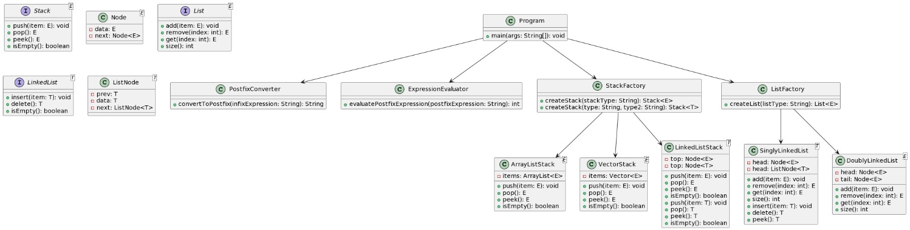

# 🚀 Calculadora Postfix

¡Bienvenido a la Calculadora Infix a Postfix! Este programa evalúa expresiones en notación Infix y convertidas posteriormente postfix y produce resultados fascinantes. ✨

## Estructura del Proyecto

El proyecto está organizado en varias carpetas y archivos que trabajan armoniosamente para ofrecer una experiencia de cálculo sublime.

### ⚙️ JDK

Este proyecto se ha desarrollado utilizando el JDK 17.0.7. Asegúrate de tener esta versión instalada para una experiencia sin problemas.

## Cómo Ejecutar el Programa

1. **Descarga del Repositorio**: Clona o descarga este repositorio en tu máquina local.

    ```bash
    git clone https://github.com/dpatzan2/Hoja-de-trabajo-4.git
    ```

2. **Configuración de JDK**: Verifica que tienes instalado el JDK 17.0.7.


4. **¡Listo para la Magia!**: Disfruta de la calculadora postfix en acción. Observa cómo las expresiones en "datos.txt" cobran vida y revelan resultados sorprendentes.


### ⚙️ UML


### 👨‍🦱 INTEGRANTES

Ihan Gilberto Alexander Marroquín Sequén (23108)
Diego Fernando Patzán Marroquín (23525)
